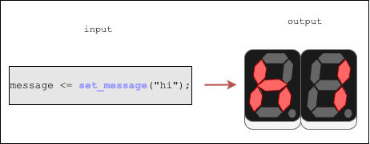
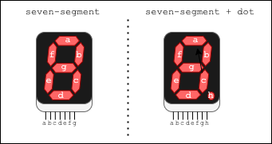

# Segment Display Interface Package Project

## Objective
This project attempts to simplify interfacing a seven-segment display.
As shown below, the user can simply call a function that sets up the seven-segment display.
Works with a subset of the VHDL character type.

## To-Do:
- ADD COMMENTS!
- flush out user guide
- design a simple DUT, drive DUT via TB
- check if we can synthesize design
- create a simple example on hardware
- once hardware is verified, scrolling either left/right, configurable speed
- images:
    - add a top-level diagram if paired with DUT